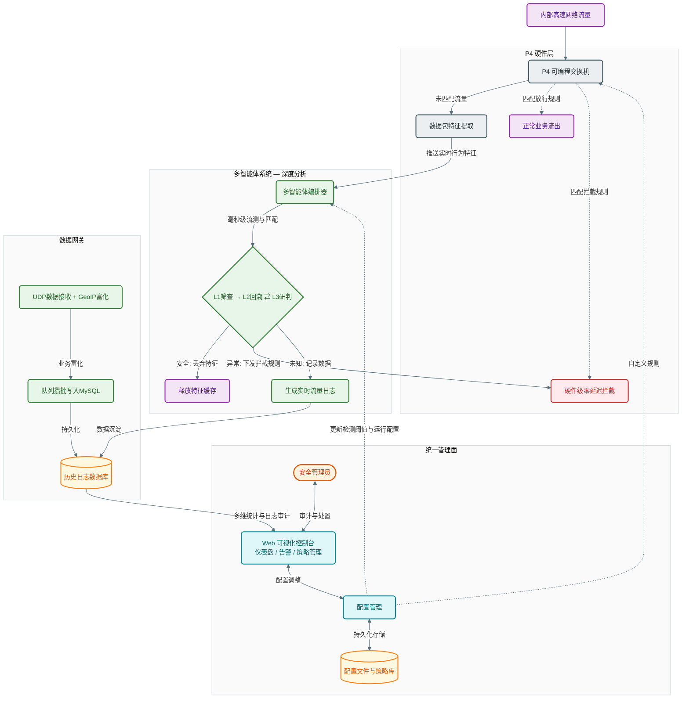

# 守藏 — P4 异构多智能体反泄密平台

基于 P4 可编程交换机的多层异构智能体联动反泄密系统。P4 硬件层毫秒级截断异常流量，多智能体系统异步深度分析，实时单流研判与长周期深度分析结合，三层闭环反馈。

## 概览

传统 DLP 方案要么纯硬件规则匹配，漏检太高；要么纯软件旁路分析，拦截来不及。守藏把 P4 交换机搬进数据面，在交换机 ASIC 里直接把流特征抠出来，由 P4 控制器和数据网关做毫秒级实时处理；判不准的，沉淀到 MySQL，由多智能体系统跑异步深度分析，挖出那些跨天、跨周、碎片拼图式的隐蔽泄密。深度分析生成的策略能直接下发 P4 流表规则，让下一次同类攻击在硬件层就被截断。

## 系统架构



## 四层联动

| 层级 | 定位 | 技术栈 | 端口 |
|------|------|--------|------|
| **P4 硬件层** | 数据面包转发、特征提取、硬线速拦截 | P4 (BMv2) + pynng + Thrift + Flask | 5000 |
| **多智能体系统** | L1筛查 → L2回溯 ⇄ L3研判 三层管线 + 逐条分析扫描 | 异步 LLM 后端（OpenAI/LMStudio/DeepSeek） | —（内部） |
| **数据网关** | UDP 流量数据接收、P4 寄存器解析、GeoIP 富化、攒批入 MySQL | UDP socket + queue.Queue + PyMySQL | 9999 |
| **统一管理面** | Web 仪表盘、策略配置、告警处置、日志审计、系统设置 | FastAPI + LayUI 纯静态前端 | 8080 |

跨层闭环：深度分析生成的策略可直接向 P4 交换机下发流表规则，也可反馈给检测阈值。管理面的人工处置（拉黑/加白、配置修改）通过 FastAPI 后端同步至各子系统。

## 快速开始

```bash
# 1. 虚拟环境
python -m venv .venv
.\.venv\Scripts\Activate.ps1      # Windows PowerShell
pip install -r requirements.txt

# 2. 初始化 MySQL 数据库
mysql -u root -p -e "source database/create_database.sql"
# 默认连接: root / (在 config_user.json 中设置密码) @ localhost:3306 → insider_threat_db

# 3. 全量启动
python main.py

# 4. 打开浏览器访问
# http://localhost:8080
```

启动参数：

| 参数 | 作用 |
|------|------|
| `python main.py` | 全量启动（四层 + 前端） |
| `--no-llm` | 禁用所有 LLM 智能体，仅保留 P4 + 数据网关 + 前端 |
| `--no-live-scan` | 禁用逐条分析队列扫描 |
| `--no-p4` | 禁用 P4 控制器 |
| `--no-flow-data` | 禁用数据网关 (UDP :9999 + MySQL 写入) |
| `--no-frontend` | 禁用 Web 前端 |
| `--frontend-port 3000` | 指定前端端口（默认 8080） |
| `--dry-run` | 打印启动配置，不实际运行 |
| `--update-geoip-now` | 启动时立即更新 GeoIP 数据库 |

## 多智能体分析流水线

核心是一条三层异步管线（`multi_agent_system/orchestrator.py`）：

```
FlowEvent → L1筛查 → L2回溯 ⇄ L3研判 → 反馈记录
                 ↓                    ↓
              dangerous          safe/dangerous
                 ↓                    ↓
              前端告警            前端告警 / 丢弃
```

- **L1 筛查**（`agents/screening_agent.py`）：快速分类。`dangerous`→直接告警，`safe`→丢弃，`suspicious`→进入 L2。使用双阈值校准：恶意置信度阈值 0.85，可疑置信度阈值 0.50。
- **L2 回溯**（`agents/backtrack_agent.py`）：查询 DB 中同源 IP 在回溯窗口内的历史相似记录，LLM 过滤关联度。回溯窗口：[0.5h, 24h, 168h, 720h, 2160h]。
- **L3 研判**（`agents/adjudication_agent.py`）：综合原始流量 + 全部历史关联数据，最终判定。`safe`→丢弃，`dangerous`→告警，`suspicious`→扩展回溯窗口继续循环。
- **反馈**（`agents/feedback_agent.py`）：处理管理员反馈，分析误报/漏报模式，自适应调整规则。

每个智能体可独立配置后端和模型——筛查跑 DeepSeek V4 Flash，研判跑 GPT-4o，反馈用本地 LM Studio，都是可行的异构组合。

## 配置管理

配置文件在 `config/` 下，双层 JSON 合并：

```
config_default.json     ← 出厂默认（所有字段的完整参考）
       ↓ 深度合并
config_user.json        ← 用户覆盖（只需写要改的字段）
```

设计原则：
- `config_default.json` 是权威模板，日常调参只动 `config_user.json`
- `config_user.json` 在 `.gitignore` 中，API 密钥和数据库密码不会外泄
- 前端通过 REST API 读写配置（智能体参数、数据库连接等），从不直接碰 JSON 文件
- 子模块不直接读 JSON——统一走 `config/loader.py`，包括 `get_database_password()`
- 支持三种 LLM 后端：**OpenAI**（含所有兼容 API）、**LM Studio**（本地模型，自动加载/卸载）、**DeepSeek V4**（支持 reasoning_effort 和 thinking 模式）

## 项目结构

```
.
├── main.py                    # 唯一入口，启动全部组件
├── config/                    # 统一配置
│   ├── config_default.json    #   出厂默认配置
│   ├── config_user.json       #   用户覆盖配置（gitignored）
│   ├── schema.py              #   数据模型定义（DatabaseConfig、智能体配置等）
│   ├── loader.py              #   加载/合并/校验/保存/密码查询
│   ├── active.py              #   运行时配置单例
│   └── shared_config.py       #   系统级常量（路径、批次参数、GeoIP 常量）
├── p4_controller/             # P4 硬件控制面
│   ├── control.py             #   Flask 守护进程 + pynng 监听 + Thrift 遥测
│   ├── add_ip.py              #   SSH 远程注入 P4 流表规则
│   ├── analyzer.py            #   流量特征提取 / 规则匹配
│   └── data_packer.py         #   P4 寄存器数据打包 / 合并流表
├── multi_agent_system/        # 多智能体系统
│   ├── orchestrator.py        #   编排器（三层管线调度）
│   ├── agents/                #   screening / backtrack / adjudication / feedback
│   ├── backends/              #   OpenAI / LMStudio / DeepSeek 后端
│   ├── core/                  #   BaseAgent 基类 + 消息数据模型
│   ├── memory/                #   模式卡片 / 聚类 / 进化 / 周度提取
│   └── orchestrators/         #   LiveScanOrchestrator 逐条扫描调度
├── backend/                   # FastAPI 统一后端
│   └── api_server.py          #   REST API + 前端静态文件托管
├── database/                  # 数据持久化
│   ├── connection.py          #   数据库连接工厂（密码由 config.loader 提供）
│   ├── writer.py              #   双队列攒批写入（INSERT + UPDATE）
│   ├── lists_manager.py       #   黑白名单 / IP 映射内存缓存
│   └── create_database.sql    #   建库 DDL
├── data_gateway/              # 数据网关
│   └── data_bridge.py         #   UDP :9999 接收 + P4 寄存器解析 + GeoIP 富化
├── frontend/                  # 纯静态前端（LayUI 2.6）
│   ├── index.html             #   主框架
│   ├── page/                  #   各功能页面（智能体配置、员工管理、IP管理、系统设置等）
│   ├── lib/                   #   第三方库（LayUI、jQuery、Font Awesome、ECharts）
│   └── api/                   #   前端静态 API mock（init.json 菜单配置等）
├── bm_runtime/                # BMv2 交换机 Thrift 运行时（自动生成）
├── p4_program/                # P4 交换机程序源码
│   └── data_platform.txt
└── requirements.txt
```

## 技术栈

**运行环境**：Python 3.11+、MySQL 8.0

**后端**：FastAPI + Flask（共存，各有分工）、uvicorn、pynng、Thrift、Paramiko

**AI 推理**：httpx（异步 HTTP 调用 LLM API），支持 OpenAI / LM Studio / DeepSeek V4

**数据处理**：PyMySQL（攒批写入）、maxminddb（GeoIP，可选）、psutil（系统监控）

**前端**：LayUI 2.6、纯静态 HTML/CSS/JS，零构建步骤

## 约束与约定

- **数据库**：MySQL 是唯一数据源。所有 DB 访问通过 `database/` 模块暴露的接口，禁止各模块私自打开连接。
- **配置**：LLM 提示词和 API 密钥一律放在 `config/config_user.json` 中，不在源码硬编码。数据库密码通过 `config.loader.get_database_password()` 获取。
- **P4 控制器**：模块支持 `try: from . import` 双模式导入（包内/独立运行），修改时保持兼容。
- **GeoIP**：`GeoLite2-City.mmdb` 通过 jsDelivr CDN 每 7 天自动更新，`maxminddb` 包缺失时自动降级跳过。
- **前端**：无构建工具，FastAPI 直接托管 `frontend/` 目录。前端通过 REST API 与后端通信，不直接读配置或数据库。
