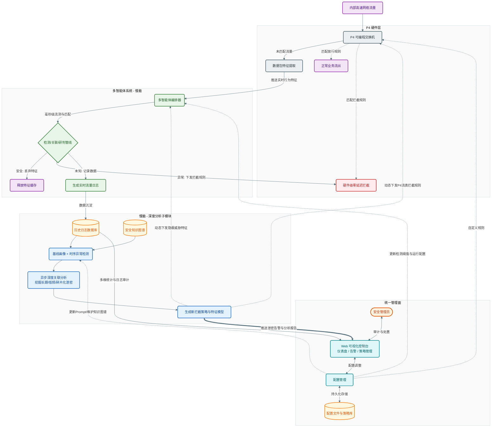

# 守藏 — P4 异构多智能体反泄密平台

基于 P4 可编程交换机的多层异构智能体联动反泄密系统。P4 硬件层毫秒级截断异常流量，多智能体系统（慢脑）异步深度分析，从实时单流研判到长周期碎片化泄密无处遁形，三层闭环反哺，一个管理面统揽全局。

## 概览

传统 DLP 方案走到头了——要么纯硬件规则匹配，漏检太高；要么纯软件旁路分析，拦截来不及。守藏把 P4 交换机搬进数据面，在交换机 ASIC 里直接把流特征抠出来，由 P4 控制器和数据标注层（快脑）做毫秒级实时处理；判不准的，沉淀到 MySQL，由多智能体系统（慢脑）跑异步深度分析，挖出那些跨天、跨周、碎片拼图式的隐蔽泄密。关键是慢脑生成的策略能直接下发 P4 流表规则，让下一次同类攻击在硬件层就被截断。

## 系统架构



## 四层联动

| 层级 | 定位 | 技术栈 | 端口 |
|------|------|--------|------|
| **P4 硬件层** | 数据面包转发、特征提取、硬线速拦截 | P4 (BMv2) + pynng + Thrift + Flask | 5000 |
| **多智能体系统（慢脑）** | 检测/关联/研判/反馈流水线 + 逐条评判扫描 | 五阶段管线 + LLM 后端（OpenAI/LMStudio/DeepSeek） | —（内部） |
| **慢脑 - 深度分析子模块** | 异步长周期分析、基线画像、策略反哺 | 基线画像 / 时序异常检测 + DeepSeek V4 | —（内部） |
| **统一管理面** | Web 仪表盘、策略配置、告警处置、日志审计 | FastAPI + LayUI 纯静态前端 | 8080 |
| **数据标注** | UDP 冷热表接收、GeoIP 富化、攒批入 MySQL | UDP socket + queue.Queue + PyMySQL | 9999 |

跨层闭环：慢脑深度分析子模块的策略输出可以直接向 P4 交换机下发流表规则，也可以反哺检测阈值。管理面的人工处置（拉黑/加白）通过 Flask API 注入 P4 硬件层。

## 快速开始

```bash
# 1. 创建虚拟环境，安装依赖
python -m venv .venv
.\.venv\Scripts\Activate.ps1      # Windows PowerShell
pip install -r requirements.txt

# 2. 初始化 MySQL 数据库
mysql -u root -p -e "source database/create_database.sql"
# 默认连接: root / 0918 @ localhost:3306 → insider_threat_db

# 3. 全量启动
python main.py

# 4. 打开浏览器访问
# http://localhost:8080
```

启动参数一览：

| 参数 | 作用 |
|------|------|
| `python main.py` | 全量启动（四层 + 前端） |
| `--no-llm` | 禁用所有 LLM 智能体，仅保留 P4 + 数据标注 + 前端 |
| `--no-slow-brain` | 仅禁用深度分析子模块（基线画像+时序异常） |
| `--no-live-scan` | 禁用逐条评判队列扫描 |
| `--no-p4` | 禁用 P4 控制器 |
| `--no-cold-table` | 禁用 UDP 冷表处理器 |
| `--no-frontend` | 禁用 Web 前端 |
| `--frontend-port 3000` | 指定前端端口（默认 8080） |
| `--dry-run` | 打印启动配置，不实际运行 |
| `--update-geoip-now` | 启动时立即更新 GeoIP 数据库 |
| `--geoip-update-interval 168` | 自定义 GeoIP 更新间隔（小时），0 禁用 |

## 多智能体分析流水线

多智能体系统的核心是一条五阶段固定流水线：

```
FlowEvent → 检测 → 关联 → 研判 → 规则自生成 → 反馈记录
```

- **检测**（始终执行）：轻量模型对单条流做快速判定。结论为 SAFE 则短路退出，不再进入后续阶段。
- **关联**（仅 SUSPICIOUS/MALICIOUS 触发）：以 IP 为键缓冲时间窗口内的可疑流，攒够阈值后批量送入模型做关联分析。
- **研判**：综合检测结果和关联结果，给出最终威胁判定和处置建议。
- **规则自生成**：若置信度超过阈值且判定为 MALICIOUS，自动生成黑名单规则写入知识库。
- **反馈记录**：归档判定结果，供管理员事后审查和标注。

每个智能体可以独立配置后端和模型——检测跑本地 qwen3.5-9b，研判调云端 GPT-4o，反馈用 DeepSeek V4，都是可行的异构组合。

## 配置管理

配置文件在 `config/` 下，双层 JSON 合并：

```
config_default.json     ← 出厂默认（所有字段的完整参考）
       ↓ 深度合并
config_user.json        ← 用户覆盖（只需写要改的字段）
```

设计原则：
- `config_default.json` 是权威参考，不直接编辑
- 日常调参只动 `config_user.json`
- 前端通过 REST API 读写配置，从不直接碰 JSON 文件
- 子模块不直接读 JSON——统一走 `config/loader.py`

支持三种 LLM 后端：**OpenAI**（含所有兼容 API）、**LM Studio**（本地模型，自动加载/卸载）、**DeepSeek V4**（支持 reasoning_effort 和 thinking 模式）。

## 项目结构

```
.
├── main.py                    # 唯一入口，启动全部组件
├── config/                    # 统一配置（schema + loader + shared）
│   ├── config_default.json    #   出厂默认配置
│   ├── config_user.json       #   用户覆盖配置
│   ├── schema.py              #   数据模型定义
│   ├── loader.py              #   加载/合并/校验/保存
│   └── shared_config.py       #   数据库连接、路径等常量
├── p4_controller/             # P4 硬件控制面
│   ├── control.py             #   Flask API + pynng 探针 + Thrift 遥测
│   ├── add_ip.py              #   黑白名单操作的统一入口
│   ├── analyzer.py            #   数据包分析判官
│   └── data_packer.py         #   数据打包底座
├── multi_agent_system/        # 多智能体系统
│   ├── __init__.py            #   MultiAgentSystem 主类
│   ├── orchestrator.py        #   编排器（流水线调度）
│   ├── agents/                #   检测 / 关联 / 研判 / 反馈 / 基线 / 时序
│   ├── backends/               #   OpenAI / LMStudio / DeepSeek 后端
│   ├── core/                  #   消息模型 + 知识库引擎
│   └── bus/                   #   消息总线
├── backend/                   # FastAPI 统一后端
│   └── api_server.py          #   REST API + 前端静态文件托管
├── database/                  # 数据持久化
│   ├── writer.py              #   队列攒批写入 MySQL
│   ├── lists_manager.py       #   黑白名单 / IP 映射缓存
│   └── create_database.sql    #   建库 DDL
├── data_labeling/             # 数据标注与 UDP 接收
│   └── cold_table_processor.py  # 冷热表合并 + GeoIP 富化
├── p4_program/                # P4 交换机程序源码（独立编译）
│   └── data_platform.txt
├── frontend/                  # 纯静态前端（LayUI）
└── requirements.txt
```

## 技术栈

**运行环境**：Python 3.11+、MySQL 8.0

**后端**：FastAPI + Flask（共存，各有分工）、uvicorn、pynng、Thrift、Paramiko

**AI 推理**：httpx（异步 HTTP 调用 LLM API），支持 OpenAI / LM Studio / DeepSeek V4

**数据处理**：PyMySQL（攒批写入）、maxminddb（GeoIP，可选）、psutil（系统监控）

**前端**：LayUI 2.6、纯静态 HTML/CSS/JS，零构建步骤

## 约束与约定

- **数据库**：MySQL 是唯一数据源。所有 DB 访问必须通过 `database/` 模块暴露的接口，禁止各模块私自打开连接。
- **配置**：LLM 提示词和 API 密钥一律放在 `config/config_user.json` 中，不在源码中硬编码。
- **P4 控制器**：模块支持 `try: from . import` 双模式导入（包内/独立运行），修改时保持兼容。
- **GeoIP**：`GeoLite2-City.mmdb` 通过 jsDelivr CDN 每 7 天自动更新，`maxminddb` 包缺失时自动降级跳过。
- **前端**：无构建工具，FastAPI 直接托管 `frontend/` 目录。前端通过 REST API 与后端通信，不直接读配置或数据库。
