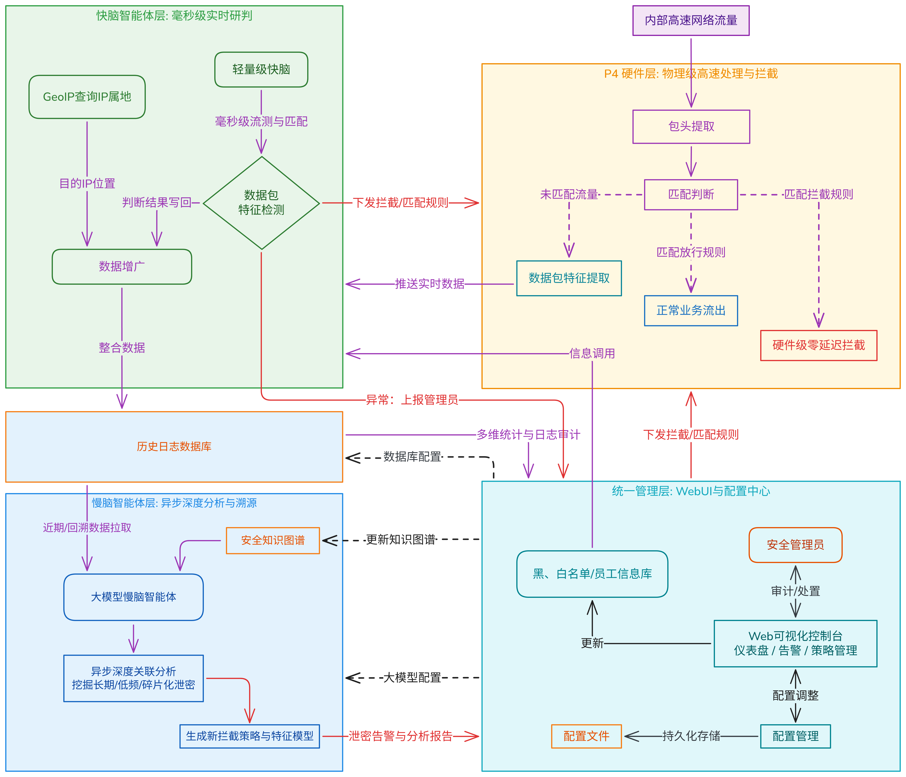

# 守藏 — P4 异构多智能体反泄密平台

基于 P4 可编程交换机的多层异构智能体联动反泄密系统。P4 硬件层毫秒级截断异常流量，多智能体系统异步深度分析，实时单流研判与长周期深度分析结合，三层闭环反馈。

## 快速开始

### 环境要求

- **Python** 3.11+
- **MySQL** 8.0
- **P4 交换机**：BMv2 (`simple_switch`) 或 Tofino 硬件交换机

### 1. 创建虚拟环境并安装依赖

```bash
python -m venv .venv
.\.venv\Scripts\Activate.ps1      # Windows PowerShell
# 或 source .venv/bin/activate    # Linux / macOS

pip install -r requirements.txt
```

### 2. 初始化 MySQL 数据库

登录 MySQL 并执行建库脚本：

```bash
mysql -u root -p -e "source database/create_database.sql"
```

执行后会在本地 MySQL 中创建 `insider_threat_db` 数据库及以下四张表：

| 表名 | 说明 |
|------|------|
| `blacklist` | 黑名单（已知恶意 IP、威胁等级、攻击类型） |
| `whitelist` | 白名单（受信任 IP，如 CDN/DNS/云服务） |
| `ip_dept_map` | 员工 IP-部门映射（工号、IP、部门、姓名） |
| `traffic_log` | 流量日志（P4 上报的流特征 + AI 判定结果） |

### 3. 配置数据库连接和 API 密钥

编辑 `config/config_user.json`，**至少需要配置数据库密码**：

```json
{
  "database": {
    "password": "你的MySQL密码"
  },
  "backends": {
    "deepseek": {
      "api_key": "你的DeepSeek API密钥"
    }
  }
}
```

> **说明**：`config/config_default.json` 是出厂默认模板，`config/config_user.json` 只需写你要覆盖的字段，两者深度合并后生效。`config_user.json` 已在 `.gitignore` 中，不会提交到 Git。

三种 LLM 后端可选：
- **DeepSeek V4**（推荐）：在 `screening.backend` / `backtrack.backend` / `adjudication.backend` 中设为 `"deepseek"`
- **OpenAI 兼容 API**：设为 `"openai"`，可接入任何兼容 OpenAI 接口的服务
- **LM Studio**（本地模型）：设为 `"lmstudio"`，无需 API 密钥，模型自动加载

### 4. P4 交换机端配置

P4 程序源码在 [`p4_program/data_platform.txt`](p4_program/data_platform.txt)。

#### 4.1 搭建网络拓扑

首先在 P4 VM 中创建 network namespace 和 veth pair，模拟内网主机与交换机的连接：

```bash
# 创建两个主机命名空间
sudo ip netns add h1
sudo ip netns add h2

# 制作两根虚拟网线（h1↔s1, h2↔s2）
sudo ip link add veth_h1 type veth peer name veth_s1
sudo ip link add veth_h2 type veth peer name veth_s2

# 把网线 host 端插入命名空间，配置 IP 并启动
sudo ip link set veth_h1 netns h1
sudo ip netns exec h1 ip addr add 10.0.0.1/24 dev veth_h1
sudo ip netns exec h1 ip link set veth_h1 up
sudo ip netns exec h1 ip link set lo up

sudo ip link set veth_h2 netns h2
sudo ip netns exec h2 ip addr add 10.0.0.2/24 dev veth_h2
sudo ip netns exec h2 ip link set veth_h2 up
sudo ip netns exec h2 ip link set lo up

# 把网线交换机端启动
sudo ip link set veth_s1 up
sudo ip link set veth_s2 up
```

#### 4.2 编译 P4 程序

```bash
# 新版 p4c
p4c --target bmv2 --arch v1model --std p4-16 \
    p4_program/data_platform.txt \
    -o p4_program/data_platform.json

# 旧版 VM 若 p4c 不可用，改用 p4c-bm2-ss
p4c-bm2-ss --target bmv2 --arch v1model \
    p4_program/data_platform.txt \
    -o p4_program/data_platform.json
```

#### 4.3 启动 BMv2 交换机

```bash
sudo simple_switch --device-id 0 \
    --thrift-port 9100 \
    --notifications-addr "tcp://0.0.0.0:10001" \
    --log-console \
    -i 1@veth_s1 -i 2@veth_s2 \
    p4_program/data_platform.json
```

> `--notifications-addr` 开启 pynng IPC 通道，地址须与控制器的 `P4_SWITCH_IPC` 一致；`--thrift-port 9100` 供控制器读写寄存器和流表。交换机端口接 `veth_s1`/`veth_s2`（交换机侧），非 `veth_h1`/`veth_h2`（主机侧）。

#### 4.4 配置交换机端口映射

交换机启动后，在另一个终端中用 `simple_switch_CLI` 写入端口映射规则（P4 程序 `port_mapping_table` 要求端口 1↔2 互通）：

```bash
simple_switch_CLI --thrift-port 9100
```

进入 CLI 后执行：

```
table_add MyIngress.port_mapping_table MyIngress.set_egress 1 => 2
table_add MyIngress.port_mapping_table MyIngress.set_egress 2 => 1
```

> 不配置端口映射，`port_mapping_table.apply().hit` 返回 false，所有流量在 Ingress 阶段被直接 drop。

#### 4.5 配置控制器连接 IP

编辑 [`p4_controller/control.py`](p4_controller/control.py#L37)：

```python
P4_SWITCH_IPC = 'tcp://192.168.56.102:10001'  # 改成 BMv2 虚拟机实际 IP
```

> IP 必须与 `simple_switch --notifications-addr` 中的地址一致。

BMv2 的 Thrift 端口（9100）默认通过 `127.0.0.1` 本地连接。若 BMv2 在远程 VM 中，需做端口转发：

```bash
ssh -L 9100:127.0.0.1:9100 user@192.168.56.102
```

#### 4.6 拷贝 Thrift stubs

控制器通过 Thrift 协议直连 BMv2，需要 [`bm_runtime/`](bm_runtime/) 目录中的 Python bindings。从 P4 VM 拷贝：

```bash
scp -r user@192.168.56.102:/usr/local/share/p4c/bm_runtime/standard bm_runtime/
scp -r user@192.168.56.102:/usr/local/share/p4c/bm_runtime/simple_pre bm_runtime/
```

> 控制器启动时会自动清空交换机寄存器及黑白名单流表，并从每 100 秒拉取一次的寄存器数据中重置状态。

### 5. （可选）下载 GeoIP 数据库

GeoIP 用于流量地理位置富化（可选组件，缺失时自动跳过）：

```bash
python main.py --update-geoip-now
```

首次运行时会从 jsDelivr CDN 下载 `GeoLite2-City.mmdb` 到 `data_gateway/` 目录。系统默认每 7 天自动更新。

### 6. 注入初始数据

运行以下脚本将示例数据（黑白名单、员工 IP 映射）写入数据库：

```bash
python tests/test_data.py
```

### 7. 启动系统

```bash
# 全量启动（四层 + 前端）
python main.py

# 打开浏览器访问
# http://localhost:8080
```

#### 启动参数

| 参数 | 作用 |
|------|------|
| `python main.py` | 全量启动（所有层 + 前端） |
| `--no-llm` | 禁用 LLM 智能体，仅保留 P4 + 数据网关 + 前端 |
| `--no-live-scan` | 禁用逐条分析队列扫描 |
| `--no-p4` | 禁用 P4 控制器 |
| `--no-data-gateway` | 禁用数据网关（UDP :9999 + MySQL 写入） |
| `--no-frontend` | 禁用 Web 前端 |
| `--frontend-port 3000` | 指定前端端口（默认 8080） |
| `--dry-run` | 打印启动配置，不实际运行 |
| `--update-geoip-now` | 启动时立即更新 GeoIP 数据库 |
| `--geoip-update-interval 168` | GeoIP 更新间隔（小时），0 禁用 |

启动后各服务端口：

| 服务 | 端口 | 说明 |
|------|------|------|
| Web 前端 (FastAPI) | 8080 | 仪表盘 / REST API / 静态文件 |
| P4 控制面 (Flask) | 5000 | pynng 接收 + 黑白名单 API |
| 数据网关 (UDP) | 9999 | 流量数据接收 + GeoIP 富化 |

---

## tests/ 文件夹说明

[`tests/`](tests/) 包含三个独立脚本，用于开发调试和测试：

### `test_data.py` — 示例数据注入

向数据库注入预定义的：
- **黑名单**（35 条）：C2 服务器、恶意软件分发、暴力破解、Tor 出口、挖矿池、钓鱼、僵尸网络等
- **白名单**（30 条）：内网基础设施、公共 DNS、CDN、云服务商、代码仓库、系统更新源、NTP 等
- **员工 IP 映射**（30 条）：覆盖财务部、研发部、人事部、运维部、市场部、法务部、管理层

```bash
python tests/test_data.py
```

> 重复执行是幂等的（`ON DUPLICATE KEY UPDATE`），不会报错。

### `reset_database.py` — 数据库一键重置

删除并重建整个 `insider_threat_db` 数据库，然后自动注入 `test_data.py` 的初始数据。还会清除前端告警缓冲区、LiveScan 断点文件、记忆系统（SQLite + 模式卡片）。

```bash
python tests/reset_database.py
```

> 适合开发调试时"回到初始状态"，**生产环境慎用**（会删除所有数据）。

### `test_traffic_scenarios.py` — P4 全场景测试流量生成器

**在 P4 VM 的 h1 命名空间中运行**，通过 scapy 向 P4 交换机发包（经由 `veth_h1` → `veth_s1`），覆盖 6 组测试场景：

| 分组 | 说明 |
|------|------|
| Group 1 | 黑名单 src_ip — 内网被控主机（P4 硬件丢弃 + 数据库高危） |
| Group 2 | 白名单 dst_ip — P4 绕过审计 + 零风险评分 |
| Group 3 | 黑名单 dst_ip — 可疑流量（数据库高危评分） |
| Group 4 | 已知攻击模式 — 恶意流量（C2/反弹Shell/APT/DNS隧道/挖矿） |
| Group 5 | 边界情况（超大流量白名单、朝鲜/伊朗 IP、心跳探测） |
| Group 6 | 跨部门行为对比（财务 vs 研发 vs 运维，同部门正常/异常） |

```bash
# 在 P4 VM 的 h1 命名空间中运行
sudo ip netns exec h1 python tests/test_traffic_scenarios.py                # 全部场景
sudo ip netns exec h1 python tests/test_traffic_scenarios.py --group 3      # 仅可疑流量
sudo ip netns exec h1 python tests/test_traffic_scenarios.py --group 1 4    # P4丢弃 + 恶意
sudo ip netns exec h1 python tests/test_traffic_scenarios.py --safe-only    # 仅安全场景（Group 1+2）
sudo ip netns exec h1 python tests/test_traffic_scenarios.py --dry-run      # 仅打印不发包
```

> 需要 P4 虚拟机环境、network namespace（h1/h2）、veth pair、BMv2 `simple_switch` 运行中且已配置端口映射。仅依赖 scapy，无项目内其他依赖。

**完整测试链路**：

```
测试流量 → P4交换机 → digest上报 → P4控制器(pynng) → data_bridge评分
    → traffic_log入库 → LiveScanOrchestrator → LLM三层管线 → 前端告警
```

1. 在 P4 VM 中搭建网络拓扑（namespace + veth pair）
2. 编译 P4 程序并启动 `simple_switch`
3. 通过 `simple_switch_CLI` 配置端口映射
4. 在本机启动系统：`python main.py`
5. 在 P4 VM 的 h1 命名空间中运行测试流量：`sudo ip netns exec h1 python tests/test_traffic_scenarios.py`
6. 观察前端 `http://localhost:8080` 的实时告警

---

## 系统架构

传统 DLP 方案要么纯硬件规则匹配，漏检太高；要么纯软件旁路分析，拦截来不及。守藏把 P4 交换机搬进数据面，在交换机 ASIC 里直接把流特征抠出来，由 P4 控制器和数据网关做毫秒级实时处理；判不准的，沉淀到 MySQL，由多智能体系统跑异步深度分析，挖出那些跨天、跨周、碎片拼图式的隐蔽泄密。深度分析生成的策略能直接下发 P4 流表规则，让下一次同类攻击在硬件层就被截断。



## 四层联动

| 层级 | 定位 | 技术栈 | 端口 |
|------|------|--------|------|
| **P4 硬件层** | 数据面包转发、特征提取、硬线速拦截 | P4 (BMv2) + pynng + Thrift + Flask | 5000 |
| **多智能体系统** | L1筛查 → L2回溯 ⇄ L3研判 三层管线 + 逐条分析扫描 | 异步 LLM 后端（OpenAI/LMStudio/DeepSeek） | —（内部） |
| **数据网关** | UDP 流量数据接收、P4 寄存器解析、GeoIP 富化、攒批入 MySQL | UDP socket + queue.Queue + PyMySQL | 9999 |
| **统一管理面** | Web 仪表盘、策略配置、告警处置、日志审计、系统设置 | FastAPI + LayUI 纯静态前端 | 8080 |

跨层闭环：深度分析生成的策略可直接向 P4 交换机下发流表规则，也可反馈给检测阈值。管理面的人工处置（拉黑/加白、配置修改）通过 FastAPI 后端同步至各子系统。

## 多智能体分析流水线

核心是一条三层异步管线（[`multi_agent_system/orchestrator.py`](multi_agent_system/orchestrator.py)）：

```
FlowEvent → L1筛查 → L2回溯 ⇄ L3研判 → 反馈记录
                 ↓                    ↓
              dangerous          safe/dangerous
                 ↓                    ↓
              前端告警            前端告警 / 丢弃
```

- **L1 筛查**（`agents/screening_agent.py`）：快速分类。`dangerous`→直接告警，`safe`→丢弃，`suspicious`→进入 L2。使用双阈值校准：恶意置信度阈值 0.85，可疑置信度阈值 0.50。
- **L2 回溯**（`agents/backtrack_agent.py`）：查询 DB 中同源 IP 在回溯窗口内的历史相似记录，LLM 过滤关联度。回溯窗口：[0.5h, 24h, 168h, 720h, 2160h]。
- **L3 研判**（`agents/adjudication_agent.py`）：综合原始流量 + 全部历史关联数据，最终判定。`safe`→丢弃，`dangerous`→告警，`suspicious`→扩展回溯窗口继续循环。
- **反馈**（`agents/feedback_agent.py`）：处理管理员反馈，分析误报/漏报模式，自适应调整规则。

每个智能体可独立配置后端和模型——筛查跑 DeepSeek V4 Flash，研判跑 GPT-4o，反馈用本地 LM Studio，都是可行的异构组合。

## 配置管理

配置文件在 [`config/`](config/) 下，双层 JSON 合并：

```
config_default.json     ← 出厂默认（所有字段的完整参考）
       ↓ 深度合并
config_user.json        ← 用户覆盖（只需写要改的字段）
```

设计原则：
- `config_default.json` 是权威模板，日常调参只动 `config_user.json`
- `config_user.json` 在 `.gitignore` 中，API 密钥和数据库密码不会外泄
- 配置在内存中以类型化结构体（dataclass）缓存，通过 `get_config("section")` 按节获取
- 前端通过 REST API 读写配置，后端通过 `save_config` / `save_config_dict` 写入并刷新缓存

## 项目结构

```
.
├── main.py                    # 唯一入口，启动全部组件
├── config/                    # 统一配置
│   ├── config_default.json    #   出厂默认配置
│   ├── config_user.json       #   用户覆盖配置（gitignored）
│   ├── schema.py              #   配置结构体定义
│   ├── store.py               #   ConfigStore 单例 + get_config / save_config API
│   ├── loader.py              #   内部辅助（合并、校验、增量计算）
│   └── shared_config.py       #   系统级常量
├── p4_controller/             # P4 硬件控制面
│   ├── control.py             #   Flask 守护进程 + pynng 监听 + Thrift 遥测
│   ├── add_ip.py              #   Thrift 直连注入 P4 流表规则
│   ├── analyzer.py            #   流量特征提取 / 规则匹配
│   ├── data_packer.py         #   P4 寄存器数据打包 / 合并流表
│   └── timer.py               #   遥测定时器
├── multi_agent_system/        # 多智能体系统
│   ├── orchestrator.py        #   编排器（三层管线调度）
│   ├── agents/                #   screening / backtrack / adjudication / feedback
│   ├── backends/              #   OpenAI / LMStudio / DeepSeek 后端
│   ├── core/                  #   BaseAgent 基类 + 消息数据模型
│   ├── memory/                #   模式卡片 / 聚类 / 进化 / 周度提取
│   └── orchestrators/         #   LiveScanOrchestrator 逐条扫描调度
├── backend/                   # FastAPI 统一后端
│   └── api_server.py          #   REST API + 前端静态文件托管
├── database/                  # 数据持久化
│   ├── connection.py          #   数据库连接工厂
│   ├── writer.py              #   双队列攒批写入（INSERT + UPDATE）
│   ├── lists_manager.py       #   黑白名单 / IP 映射内存缓存
│   └── create_database.sql    #   建库 DDL
├── data_gateway/              # 数据网关
│   └── data_bridge.py         #   UDP :9999 接收 + P4 寄存器解析 + GeoIP 富化
├── frontend/                  # 纯静态前端（LayUI 2.6）
│   ├── index.html             #   主框架
│   ├── page/                  #   各功能页面
│   ├── lib/                   #   第三方库（LayUI、jQuery、ECharts 等）
│   └── api/                   #   前端静态 API mock
├── tests/                     # 测试脚本
│   ├── test_data.py           #   示例数据注入（黑白名单 + 员工映射）
│   ├── reset_database.py      #   数据库一键重置
│   └── test_traffic_scenarios.py  #   P4 全场景测试流量生成器
├── bm_runtime/                # BMv2 交换机 Thrift 运行时（自动生成）
├── p4_program/                # P4 交换机程序源码
│   └── data_platform.txt
└── requirements.txt
```

## 技术栈

**运行环境**：Python 3.11+、MySQL 8.0

**后端**：FastAPI + Flask（共存，各有分工）、uvicorn、pynng、Thrift、Paramiko

**AI 推理**：httpx（异步 HTTP 调用 LLM API），支持 OpenAI / LM Studio / DeepSeek V4

**数据处理**：PyMySQL（攒批写入）、maxminddb（GeoIP，可选）、psutil（系统监控）

**前端**：LayUI 2.6、纯静态 HTML/CSS/JS，零构建步骤

## 约束与约定

- **数据库**：MySQL 是唯一数据源。所有 DB 访问通过 [`database/`](database/) 模块暴露的接口，禁止各模块私自打开连接。
- **配置**：LLM 提示词和 API 密钥一律放在 `config/config_user.json` 中，不在源码硬编码。
- **P4 控制器**：模块支持 `try: from . import` 双模式导入（包内/独立运行），修改时保持兼容。
- **GeoIP**：`GeoLite2-City.mmdb` 通过 jsDelivr CDN 每 7 天自动更新，`maxminddb` 包缺失时自动降级跳过。
- **前端**：无构建工具，FastAPI 直接托管 `frontend/` 目录。前端通过 REST API 与后端通信，不直接读配置或数据库。
